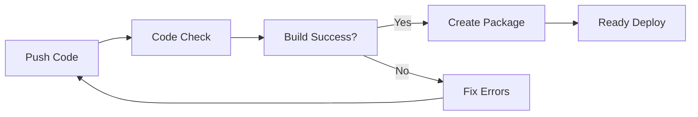

# 🚀 Hướng Dẫn CI/CD Đơn Giản (Không Docker)

## ✅ Tình huống hiện tại
Bạn đã có code hoàn chỉnh và chỉ cần CI/CD để:
- ✅ Kiểm tra code syntax
- ✅ Build project
- ✅ Tạo package deploy
- ❌ Không cần test phức tạp
- ❌ Không cần Docker

## 🔧 Setup GitHub Actions

### 1. GitHub Secrets (Tùy chọn)
Chỉ cần setup nếu muốn notification:

```bash
# Vào GitHub repo > Settings > Secrets and variables > Actions
# Thêm secrets (tùy chọn):

SLACK_WEBHOOK_URL=https://hooks.slack.com/services/... # Để nhận thông báo
```

### 2. Workflow Files
Đã tạo sẵn 2 files:

```
.github/workflows/
├── ci-cd.yml          # Kiểm tra code quality
└── deploy-simple.yml  # Tạo package deploy
```

## 🎯 Chức năng CI/CD

### **ci-cd.yml** - Code Quality Check
```yaml
Triggers: Push/PR to main, develop
Jobs:
├── backend-check     # Kiểm tra Node.js syntax
├── frontend-check    # Build React app
├── mobile-check      # Validate Flutter structure  
├── docs-check        # Kiểm tra documentation
└── quality-summary   # Tổng kết kết quả
```

### **deploy-simple.yml** - Deploy Package
```yaml
Triggers: Sau khi ci-cd.yml thành công
Jobs:
└── deploy-files      # Tạo package deployment
```

## 📦 Kết quả CI/CD

### Khi Push Code:
1. **Automatic Checks** ✅
   - Backend syntax validation
   - Frontend build test
   - Documentation check
   - Security audit

2. **Build Artifacts** 📁
   - `webapp-build`: Frontend static files
   - `deployment-package`: Full deployment package

3. **Deploy Ready** 🚀
   - Download artifact từ GitHub Actions
   - Extract và deploy lên server

## 🔄 Workflow Process



## 📋 Manual Deploy Steps

### 1. Download Package
```bash
# Từ GitHub Actions > Workflow runs > Download "deployment-package"
```

### 2. Deploy Backend
```bash
cd deployment-package/backend
cp .env.example .env  # Configure environment
npm start
```

### 3. Deploy Frontend
```bash
# Copy deployment-package/frontend/ to web server
# Configure nginx/apache to serve static files
```

## 🎉 Benefits

### ✅ Advantages
- **Simple**: Không cần Docker knowledge
- **Fast**: Build và check nhanh
- **Reliable**: Kiểm tra code before merge
- **Portable**: Deploy package work anywhere
- **Cost-effective**: Không cần container registry

### 🔍 What's Included
- Syntax validation
- Build verification  
- Security audit
- Documentation check
- Deployment artifacts
- Error notifications

## 🛠️ Customization

### Thêm More Checks
```yaml
# Trong ci-cd.yml có thể thêm:
- name: Custom Check
  run: |
    echo "Add your custom validation here"
```

### Modify Build Process
```yaml
# Trong deploy-simple.yml:
- name: Custom Build Step
  run: |
    # Add build customization
```

## 📞 Support

### Common Issues
1. **Build Failed**: Check Node.js version compatibility
2. **Missing Files**: Ensure all dependencies in package.json
3. **Deploy Errors**: Verify environment variables

### Quick Fix Commands
```bash
# Fix dependencies
npm ci

# Check syntax
node -c server.js

# Build test
npm run build
```

---

**🎯 Kết luận**: Setup này cho phép bạn có CI/CD đầy đủ mà không cần Docker, phù hợp cho việc development và deploy đơn giản!